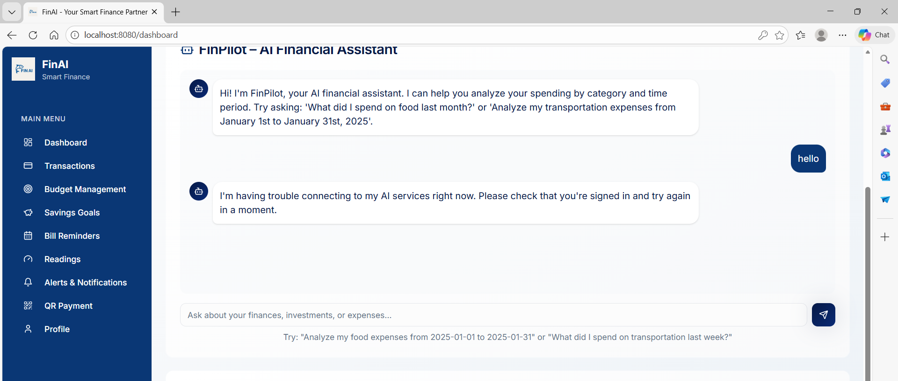

# FinAI - Intelligent Financial Management 🚀

**FinAI** is a sophisticated financial management ecosystem designed to empower users with AI-driven insights, automated budget tracking, and seamless expense management. Leveraging the power of Large Language Models (LLMs), FinAI provides a personalized financial assistant, **FinPilot**, to help you make smarter financial decisions.

---

## 📸 Preview

<p align="center">
  
  
</p>

---

## ✨ Key Features

- **🔐 Secure Authentication**: Robust user authentication system powered by JWT.
- **🤖 FinPilot AI Assistant**: Chat with your financial data using Google Gemini. Ask questions like *"Analyze my spending last month"* or *"How can I save more on groceries?"*
- **📊 Dynamic Dashboard**: Real-time visualization of your financial health, including income, expenses, and budget status.
- **💰 Smart Budgeting**: Set category-wise budgets and get notified when you're nearing your limits.
- **🎯 Goal Tracking**: Visualize your progress towards savings goals with interactive progress bars.
- **📅 Automated Reminders**: Stay on top of your bills with a dedicated reminder system.
- **📱 QR Integration**: Modern payment interface for quick transactions.
- **📈 Insightful Reports**: Comprehensive breakdown of transactions and financial patterns.

---

## 🛠️ Tech Stack

### Frontend
- **Framework**: [React.js](https://reactjs.org/) + [Vite](https://vitejs.dev/)
- **Language**: [TypeScript](https://www.typescriptlang.org/)
- **Styling**: [Tailwind CSS](https://tailwindcss.com/)
- **Icons**: [Lucide React](https://lucide.dev/)
- **UI Components**: [Shadcn UI](https://ui.shadcn.com/)

### Backend
- **Framework**: [FastAPI](https://fastapi.tiangolo.com/) (Python)
- **Database**: [SQLite](https://www.sqlite.org/) (Development)
- **AI Engine**: [Google Gemini Pro](https://ai.google.dev/)
- **Authentication**: JWT (JSON Web Tokens) with Bcrypt hashing

---

## 📂 Project Structure

```plaintext
HackOps/
├── finai-hackops/
│   ├── frontend/         # React + Vite User Interface
│   │   ├── src/
│   │   │   ├── components/  # Atomic UI components
│   │   │   ├── pages/       # Dashboard, Auth, Budget, etc.
│   │   │   └── contexts/    # State management (Auth, Theme)
│   ├── backend/          # FastAPI Python Server
│   │   ├── app/             # Application logic & routes
│   │   ├── finai_dev.db     # Local SQLite Database
│   │   └── init_database.py # Database seeding script
├── images/               # Project screenshots & assets
└── README.md             # Project documentation
```

---

## 🚀 Getting Started

### Prerequisites
- [Node.js](https://nodejs.org/) (v18 or higher)
- [Python](https://www.python.org/) (3.9 or higher)
- [Google Gemini API Key](https://aistudio.google.com/)

### Installation

1. **Clone the repository**
   ```bash
   git clone https://github.com/vinodhan07/finai-hackops.git
   cd finai-hackops/finai-hackops
   ```

2. **Frontend Setup**
   ```bash
   cd frontend
   npm install
   # Create a .env file and add:
   # VITE_API_URL=http://localhost:8000
   npm run dev
   ```

3. **Backend Setup**
   ```bash
   cd ../backend
   python -m venv venv
   source venv/bin/activate  # On Windows: venv\Scripts\activate
   pip install -r requirements.txt
   # Create a .env file and add your GEMINI_API_KEY
   python init_database.py  # Initialize database
   uvicorn app.main:app --reload
   ```

---

## 🤝 Contributing

Contributions are what make the open-source community such an amazing place to learn, inspire, and create. Any contributions you make are **greatly appreciated**.

1. Fork the Project
2. Create your Feature Branch (`git checkout -b feature/AmazingFeature`)
3. Commit your Changes (`git commit -m 'Add some AmazingFeature'`)
4. Push to the Branch (`git push origin feature/AmazingFeature`)
5. Open a Pull Request

---

## 📄 License

Distributed under the MIT License. See `LICENSE` for more information.

Developed with ❤️ by [Vinodhan](https://github.com/vinodhan07)

